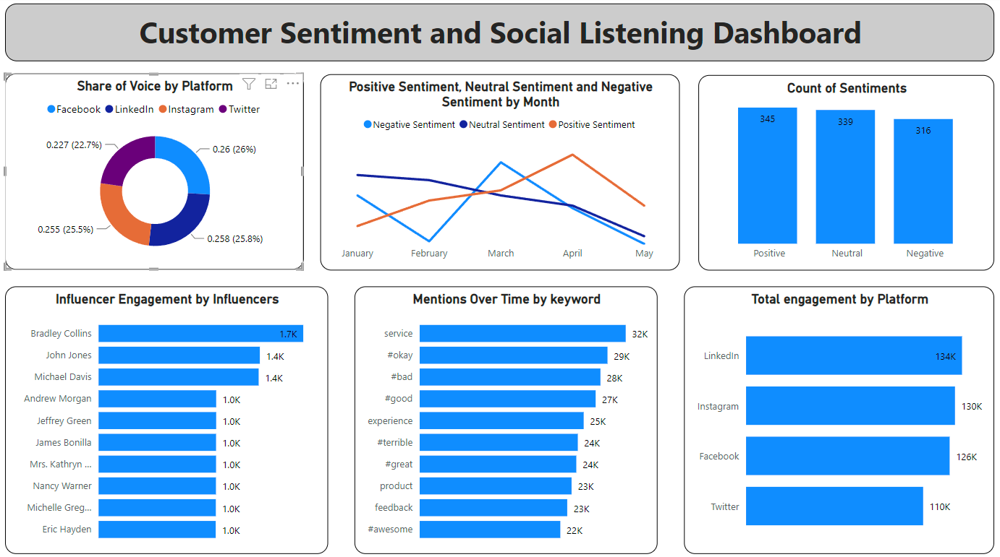

## Project Description: Customer Sentiment and Social Listening Dashboard

### Project Overview

This project involves creating a Customer Sentiment and Social Listening Dashboard using Python to generate and visualize key performance indicators (KPIs) for customer sentiment and social listening. The dashboard utilizes synthetic data generated with the Faker library and presents it through various visualizations created with PowerBI. This project aims to provide actionable insights into customer sentiment and social media performance, helping stakeholders understand and improve their engagement strategies.

### Objectives

- **Data Simulation**: Generate realistic synthetic data for customer sentiment and social listening metrics, including share of voice, sentiment analysis, top mentioned keywords/hashtags, customer feedback trends, and influencer impact.
- **Data Visualization**: Develop intuitive visualizations, such as pie charts, line charts, word clouds, bar charts, and tables to effectively communicate social listening and sentiment data.
- **Performance Analysis**: Offer insights into customer sentiment and social media performance, highlighting key metrics and trends over time.
- **Reporting**: Export the generated data to CSV files for further analysis and reporting purposes.

### Stakeholders

- **Marketing Managers**: To monitor and optimize social media strategies and campaigns.
- **Brand Managers**: To understand customer sentiment and manage brand reputation.
- **Customer Experience Teams**: To gain insights into customer feedback and improve the overall customer experience.
- **Data Analysts**: To analyze sentiment and social listening data, identify trends, and provide actionable insights.
- **Recruiters and Hiring Managers**: To evaluate the candidate's proficiency in data generation, visualization, and analysis using Python.

### Business Problems Addressed

- **Sentiment Analysis**: Understanding the distribution of customer sentiment (positive, neutral, negative) to manage brand perception.
- **Trend Analysis**: Identifying trends in customer feedback over time to inform marketing and customer service strategies.
- **Keyword and Hashtag Insights**: Analyzing top mentioned keywords and hashtags to understand customer interests and conversations.
- **Influencer Impact**: Evaluating the impact of influencers on brand engagement and reach.
- **Platform Performance**: Comparing share of voice across different social media platforms to allocate resources effectively.

### Results

The project successfully demonstrates the ability to generate, analyze, and visualize customer sentiment and social listening data. Key results include:

- **Synthetic Data Generation**: Created over 1000 rows of realistic social listening data using the Faker library.
- **Comprehensive Visualizations**: Developed multiple charts and tables to present data clearly, including:
  - Pie charts showing sentiment distribution.
  - Line charts displaying sentiment trends over time.
  - Word clouds illustrating top keywords and hashtags.
  - Bar charts representing share of voice by platform.
  - Tables listing influencer mentions with engagement metrics.

### Tools and Technologies Used

- **Python**: For data generation, analysis, and visualization.
- **Faker**: To generate realistic synthetic data for customer sentiment and social listening metrics.
- **Pandas**: For data manipulation and management.
- **PowerBI**: For creating visualizations.
- **Jupyter Notebook**: For developing and showcasing the project in an interactive format.

### Future Enhancements

- **Real-Time Data Integration**: Integrate real-time data from actual social listening tools for live performance tracking.
- **Advanced Analytics**: Implement more advanced analytics, such as sentiment prediction and influencer impact analysis.
- **Interactive Dashboards**: Develop interactive dashboards using tools like Dash or Tableau for more dynamic data exploration.

### Conclusion

This project showcases the ability to generate, analyze, and visualize customer sentiment and social listening data effectively. It demonstrates proficiency in Python programming, data analysis, and visualization, making it a valuable addition to any marketing or data analysis portfolio. The project provides valuable insights for stakeholders and can be further expanded for real-world applications.

