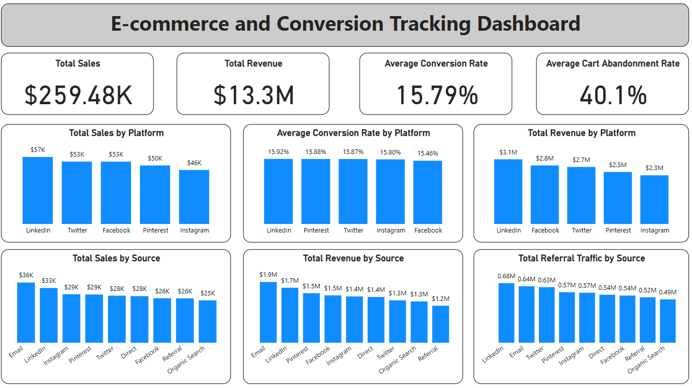

## Project Description: E-commerce and Conversion Tracking Dashboard

### Project Overview

This project revolves around the development of an E-commerce and Conversion Tracking Dashboard using Python to generate and visualize key performance indicators (KPIs) for e-commerce activities. The dashboard leverages synthetic data generated with the Faker library and presents it through various visualizations created with Matplotlib and Seaborn. The primary goal of this project is to provide actionable insights into e-commerce performance and conversion tracking, enabling stakeholders to optimize sales strategies and improve overall business outcomes.

### Objectives

- **Data Simulation**: Generate realistic synthetic data for e-commerce metrics, including total sales and revenue, conversion rate, average order value (AOV), cart abandonment rate, customer lifetime value (CLV), and referral traffic from social media.
- **Data Visualization**: Develop intuitive visualizations, such as line charts, bar charts, pie charts, funnel charts, and tables to effectively communicate e-commerce and conversion tracking data.
- **Performance Analysis**: Offer insights into e-commerce performance and conversion metrics, highlighting key trends and areas for improvement.
- **Reporting**: Export the generated data to CSV files for further analysis and reporting purposes.

### Stakeholders

- **E-commerce Managers**: To monitor and optimize sales strategies, conversion funnels, and customer engagement.
- **Marketing Analysts**: To analyze the effectiveness of marketing campaigns and channels in driving sales and conversions.
- **Product Managers**: To understand customer behavior and preferences, identify opportunities for product enhancements or promotions.
- **Business Executives**: To gain insights into overall e-commerce performance and make strategic decisions to drive business growth.
- **Recruiters and Hiring Managers**: To evaluate the candidate's proficiency in data generation, visualization, and analysis using Python.

### Business Problems Addressed

- **Sales Performance**: Understanding trends in total sales and revenue over time, identifying peak selling periods and potential revenue opportunities.
- **Conversion Tracking**: Analyzing conversion rate, average order value, and cart abandonment rate to optimize the conversion funnel and improve conversion rates.
- **Customer Lifetime Value**: Calculating CLV to assess the long-term value of customers and prioritize customer acquisition and retention efforts.
- **Referral Traffic Analysis**: Evaluating referral traffic from social media channels to measure the effectiveness of social media marketing efforts and identify high-performing platforms.
- **Optimization Opportunities**: Identifying areas for improvement in sales strategies, marketing campaigns, and website user experience to enhance overall e-commerce performance.

### Results

The project successfully demonstrates the ability to generate, analyze, and visualize e-commerce and conversion tracking data. Key results include:

- **Synthetic Data Generation**: Created over 1000 rows of realistic e-commerce performance data using the Faker library.
- **Comprehensive Visualizations**: Developed multiple charts and tables to present data clearly, including:
  - Line charts showing sales and revenue trends over time.
  - Bar charts displaying conversion rate by social media platform.
  - Pie charts representing the breakdown of traffic sources from social media.
  - Funnel charts illustrating the customer journey from social media to purchase.
  - Tables listing top referring social media channels with sales metrics.
- **Export Functionality**: Enabled data export to CSV files for further analysis, ensuring flexibility in using the data in various reporting tools and platforms.

### Tools and Technologies Used

- **Python**: For data generation, analysis, and visualization.
- **Faker**: To generate realistic synthetic data for e-commerce metrics.
- **Pandas**: For data manipulation and management.
- **PowerBI**: For creating visualizations.
- **Jupyter Notebook**: For developing and showcasing the project in an interactive format.

### Future Enhancements

- **Real-Time Data Integration**: Integrate real-time data from actual e-commerce platforms and analytics tools for live performance tracking.
- **Advanced Analytics**: Implement more advanced analytics, such as predictive modeling and customer segmentation, to enhance insights and decision-making.
- **Interactive Dashboards**: Develop interactive dashboards using tools like Dash or Tableau for more dynamic data exploration and user engagement.

### Conclusion

This project showcases the ability to generate, analyze, and visualize e-commerce and conversion tracking data effectively. It demonstrates proficiency in Python programming, data analysis, and visualization, making it a valuable addition to any e-commerce or data analysis portfolio. The project provides actionable insights for stakeholders to optimize sales strategies, improve conversion rates, and drive business growth.

