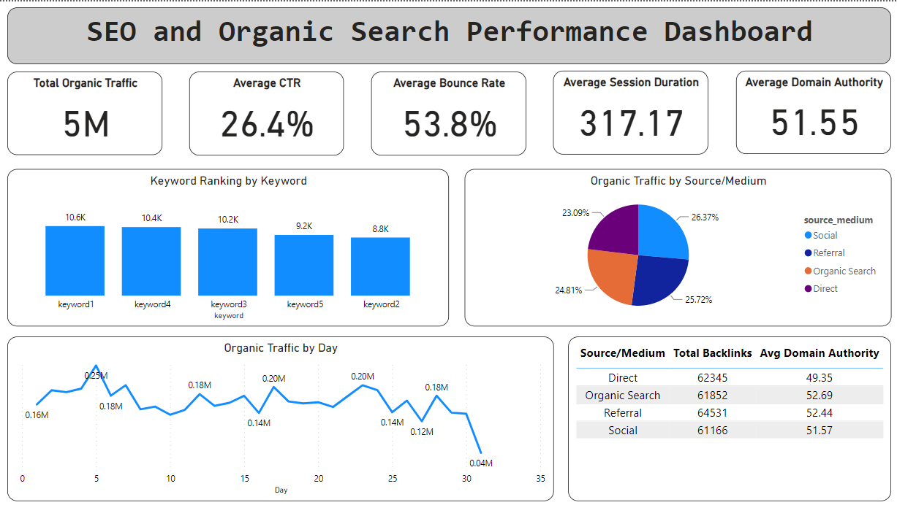

# Digital_marketing_dashboards## Project Description: SEO and Organic Search Performance Dashboard

### Project Overview

This project entails the creation of an SEO and Organic Search Performance Dashboard using Python for data generation and Power BI for visualization. The dashboard provides comprehensive insights into the effectiveness of SEO strategies by visualizing key performance indicators (KPIs) and metrics. It includes synthetic data generation, data export, and advanced visualizations to help stakeholders understand and optimize their organic search performance.

### Objectives

- **Data Simulation**: Use the `faker` library to generate realistic synthetic data for SEO performance metrics, including organic traffic, keyword rankings, CTR, bounce rate, average session duration, backlinks, and domain authority.
- **Data Visualization**: Create insightful visualizations in Power BI, such as line charts, bar charts, pie charts, scatter plots, and tables to represent the data clearly and effectively.
- **Performance Analysis**: Provide actionable insights into SEO performance across different dimensions and time periods, enabling data-driven decision-making.
- **Reporting**: Export generated data to CSV files for further analysis and use in various reporting tools.

### Stakeholders

- **SEO Managers**: To monitor and optimize SEO strategies and performance.
- **Data Analysts**: To analyze SEO data, identify trends, and provide actionable insights.
- **Business Executives**: To gain a high-level overview of SEO performance and its impact on overall business goals.
- **Recruiters and Hiring Managers**: To evaluate the candidate's proficiency in data generation, visualization, and analysis using Python and Power BI.

### Business Problems Addressed

- **Visibility and Traffic**: Understanding how various keywords and search strategies are driving organic traffic.
- **Keyword Performance**: Analyzing the rankings of top keywords and their impact on traffic and engagement.
- **User Engagement**: Monitoring metrics such as CTR, bounce rate, and average session duration to gauge user engagement and satisfaction.
- **Backlink Analysis**: Evaluating the quantity and quality of backlinks and their contribution to domain authority.
- **Optimization Opportunities**: Identifying areas for improvement in SEO strategies to enhance performance and ROI.

### Results

The project successfully demonstrates the ability to generate, analyze, and visualize SEO data effectively. Key results include:

- **Synthetic Data Generation**: Created over 1000 rows of realistic SEO performance data using the Faker library.
- **Comprehensive Visualizations**: Developed multiple charts and tables in Power BI to present data clearly, including:
  - **Line Chart**: Organic Traffic over Time.
  - **Bar Chart**: Keyword Rankings for Top Keywords.
  - **Pie Chart**: Traffic by Source/Medium.
  

### Tools and Technologies Used

- **Python**: For data generation and export.
- **Faker**: To generate realistic synthetic SEO data.
- **Pandas**: For data manipulation and management.
- **Power BI**: For creating advanced data visualizations and dashboards.
- **Jupyter Notebook**: For developing and showcasing the project in an interactive format.

### Future Enhancements

- **Real-Time Data Integration**: Integrate real-time data from actual SEO tools like Google Search Console, Ahrefs, or SEMrush for live performance tracking.
- **Advanced Analytics**: Implement more advanced analytics, such as predictive modeling and trend analysis.
- **Interactive Dashboards**: Develop interactive dashboards using Power BI features like slicers and filters for more dynamic data exploration.

### Conclusion

This project showcases the ability to generate, analyze, and visualize SEO data effectively. It demonstrates proficiency in Python programming, data analysis, and visualization using Power BI, making it a valuable addition to any data analysis or marketing portfolio. The project provides valuable insights for stakeholders and can be further expanded for real-world applications.

