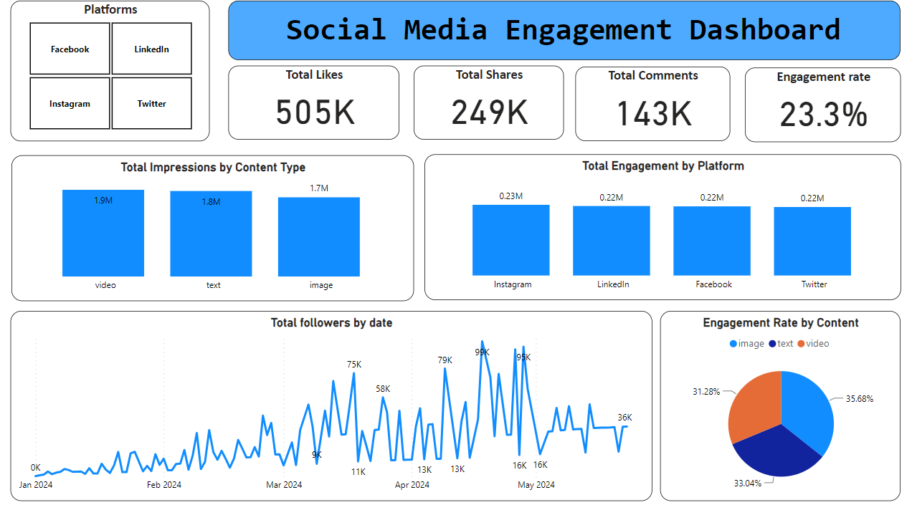

### Social Media Engagement Dashboard Project

#### Project Description

This project showcases the development of a comprehensive Social Media Engagement Dashboard using Python and the Faker library to generate synthetic data. The dashboard provides actionable insights into social media performance across various platforms, assisting stakeholders in making informed decisions to enhance their social media strategies.

#### Objectives
- **Create a dynamic and interactive dashboard** to monitor key social media performance indicators (KPIs).
- **Simulate realistic social media data** to demonstrate data analysis and visualization techniques.
- **Provide insights into social media engagement trends** to optimize content strategy and improve overall performance.
- **Develop a versatile tool** that can be adapted for real-world social media analytics and reporting needs.

#### Stakeholders
- **Marketing Teams**: To track and analyze the performance of social media campaigns.
- **Content Creators**: To identify top-performing content and optimize future posts.
- **Social Media Managers**: To monitor engagement metrics and follower growth across multiple platforms.
- **Business Executives**: To gain a high-level overview of social media impact on business objectives.

#### Business Problems
- **Lack of consolidated view**: Difficulty in tracking and comparing social media performance across different platforms.
- **Identifying effective content**: Challenges in pinpointing which types of content generate the most engagement.
- **Resource allocation**: Inefficiencies in directing marketing efforts and resources to the most impactful social media activities.
- **Trend analysis**: Need for better understanding of engagement trends over time to inform strategy adjustments.

#### Results
- **Comprehensive Dashboard**: A user-friendly dashboard displaying critical social media metrics such as total engagements, engagement rate, follower growth, and click-through rate (CTR).
- **Data Visualization**: Utilization of various charts and visualizations, including line charts, bar charts, pie charts, tables, and heat maps, to represent data clearly and intuitively.
- **Simulated Data**: Realistic synthetic data generated using the Faker library to mimic actual social media performance, providing a robust testing ground for analysis techniques.
- **Insightful Analysis**: Ability to identify top-performing posts, optimal posting times, and content types that drive the most engagement, facilitating data-driven decision-making.

#### Key Features
- **Follower Growth Line Chart**: Visualizes the increase in followers over time, helping stakeholders track audience growth.
- **Engagement Bar Chart**: Compares total engagements across different social media platforms, highlighting where efforts are most effective.
- **Engagement Rate Pie Chart**: Breaks down engagement rates by content type, assisting in content strategy optimization.
- **Top Posts Table**: Lists the top 10 posts based on engagement, providing a quick reference for successful content.

#### Technologies Used
- **Python**: For data manipulation and analysis.
- **Pandas**: For data handling and processing.
- **PowerBI**: For dataVisualization.

#### Conclusion
This project demonstrates the ability to create a powerful and insightful social media engagement dashboard from scratch. By leveraging synthetic data, it highlights essential data analysis and visualization skills relevant to real-world social media marketing scenarios. This project is an excellent showcase for recruiters looking for candidates with strong data analysis, visualization, and social media analytics capabilities.
